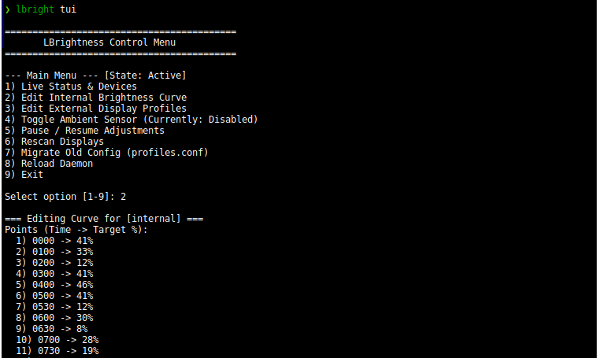
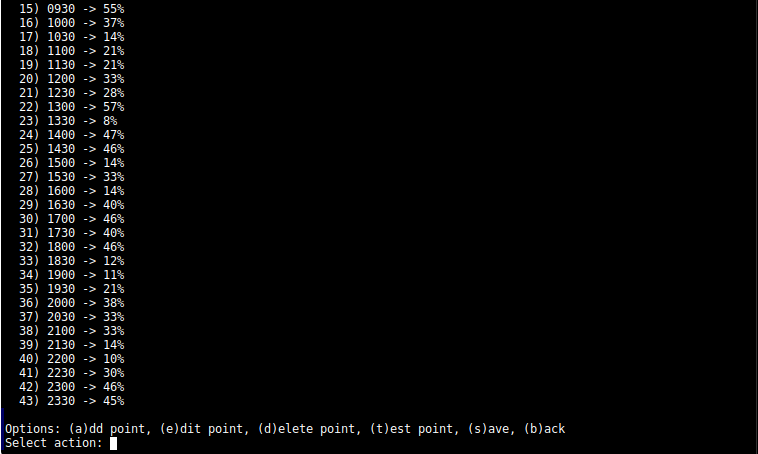

# LTvBrightness

<picture>
  <source media="(prefers-color-scheme: dark)" srcset="assets/banner_dark.svg">
  <source media="(prefers-color-scheme: light)" srcset="assets/banner_light.svg">
  
</picture>

[](https://github.com/LeanBitLab/adaptive-brightness-linux/releases/latest) [](https://github.com/LeanBitLab/adaptive-brightness-linux/releases) [](https://github.com/LeanBitLab/adaptive-brightness-linux/stargazers) [](https://github.com/sponsors/LeanBitLab)

**LTvBrightness** (adaptive-brightness-linux) is a lightweight, intelligent auto-brightness system for Linux that automatically adjusts your screen brightness based on the time of day and **learns from your manual adjustments**, similar to Android's adaptive brightness feature. It comes equipped with a premium, minimalist monochrome desktop GUI control panel built with **PySide6**.

This is an original, premium, open-source utility designed and developed by [LeanBitLab](https://github.com/LeanBitLab) from the ground up to solve screen strain and bring intelligent backlight automation to Linux desktops.

---

## 🎨 Screenshots

<table>
  <tr>
    <td align="center"><b>Dashboard View</b></td>
    <td align="center"><b>Profile Editor View</b></td>
  </tr>
  <tr>
    <td></td>
    <td></td>
  </tr>
</table>

---

## 🚀 Key Features

- **📈 Interactive Spline Curve Graph** - Draws a custom-drawn, smooth 24-hour visual representation of your active brightness profile with draggable coordinate nodes to adjust target levels in real time.
- **☀️ Circular Brightness Dial & Manual Override** - Visual dial showing current brightness, with manual overrides that seamlessly disable auto mode temporarily.
- **⚙️ System Control Center**:
  - **Disable / Enable Timer**: Instantly control the background `systemd` daemon check timer.
  - **Adjust Now**: Snaps the screen to the active profile target level.
  - **Restart Daemon**: Applies profiles and configurations fresh.
  - **Reset Overrides**: Clears any active manual offsets, restoring normal profile curve snap.
  - **Force Learn**: Save the current manual override level immediately into the active time block.
  - **Restore Defaults**: Instantly resets curves to factory-calibrated defaults.
- **⏸️ Advanced Pause controls** - Pause adjustments for `1h`, `3h`, `8h`, or `Indefinitely` with an elegant live countdown panel.
- **✍️ Visual Profile Editor**:
  - **Dynamic Time Blocks**: Add or delete time blocks, adjust brightness sliders, or double-click to input exact spinbox percentages.
  - **Interactive Time Setting**: Direct manual `QTimeEdit` boxes to change time block schedules dynamically.
- **📋 Real-Time Logging** - Built-in syntax-highlighted activity logs screen to monitor system events and learning metrics.
- **📥 System Tray & Autostart Integration**:
  - Minimizes silently to the system tray with standard right-click quick menus.
  - **Dual-Checkbox Setup**: Configure "Start Control Panel on Login" and/or "Start Minimized in System Tray" directly via simple UI checkboxes.

---

## ⚙️ How the Adaptive System Works

- **Time-Based Profiles:** By default, brightness smoothly ramps up during sunrise, peaks during the day, and gracefully ramps down during sunset into the night.
- **Adaptive Learning:** The script runs in the background via a `systemd` user timer. If you manually change your screen brightness using your keyboard keys, monitor slider, or GUI manual slider, the system detects your intervention. It then **permanently saves** your newly preferred brightness to the currently active time block's profile!
- **Intelligent Verification:** Distinguishes between manual adjustments and system reboots or long sleep gaps, ensuring your profiles aren't accidentally overwritten with stale data.
- **Granular Control:** Profiles run in customizable 15-30 minute intervals, providing continuous, smooth transitions without shocking your eyes.
- **Hardware Agnostic:** Communicates directly with the Linux kernel's `/sys/class/backlight` using `brightnessctl`, which means it works seamlessly on GNOME, KDE Plasma, XFCE, Sway, Hyprland, and other window managers.

---

## 📦 Prerequisites & Installation

### Prerequisites
- `bash` (Default on almost all distros)
- `systemd` (Default on most distros)
- `brightnessctl` (Available in most Linux package managers)
- `python3` and `pip` (For PySide6 GUI interface dependencies)

Install `brightnessctl` if you haven't already:
```bash
# Debian/Ubuntu based systems
sudo apt update && sudo apt install brightnessctl

# Arch Linux
sudo pacman -S brightnessctl

# Fedora
sudo dnf install brightnessctl
```

### Installation

#### Option A: Native Debian Package (Recommended for Debian/Ubuntu)
Compile and install a system-wide package that integrates natively:

1. Build the package:
   ```bash
   chmod +x build-deb.sh
   ./build-deb.sh
   ```
2. Install the compiled package:
   ```bash
   sudo apt install ./adaptive-brightness_1.0.0_all.deb
   ```

#### Option B: Local User Script (Universal)
Clone and run the standard installer to install in user space (`~/.local/bin`):

```bash
git clone https://github.com/LeanBitLab/adaptive-brightness-linux.git
cd adaptive-brightness-linux
chmod +x install.sh
./install.sh
```
*Note: Both installation methods automatically configure your standard XDG desktop launcher, meaning you can search for and launch "Adaptive Brightness" directly from your application launcher or menu drawer.*

To run the GUI directly from the terminal:
```bash
auto-brightness-gui
```

---

## 📂 Configuration & Logs

The system stores your configurations and states in standard user directories:

- **Profiles Configuration**: `~/.config/auto-brightness/profiles.conf` (Stores the HHMM=PERCENT mappings).
- **Diagnostics & Logs**: `~/.local/state/auto-brightness.log` (Monitors script snap-to-profile and learning actions).
- **State Cache**: `~/.local/state/auto-brightness.state` (Saves active script state metrics).

---

## 📚 Advanced Architecture & Customization
Curious about how the mathematical adaptive learning model evaluates delta differences under the hood, or how to customize the core shell script execution?
👉 **[Read the Full Architecture & Customization Guide here](script-guide.md)**

---

## 💖 Support our Work
If you love this tool and want to support its ongoing development, consider sponsoring us! Your contributions help us maintain and improve our open-source utilities.

👉 **[Sponsor LeanBitLab on GitHub Sponsors](https://github.com/sponsors/LeanBitLab)**

---

## 🛡️ LeanBitLab Ecosystem

Check out our other projects: 👉 [LeanBitLab Projects](https://github.com/LeanBitLab#-current-projects)
