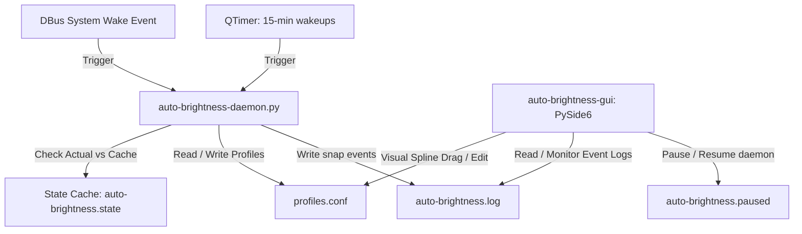

# Comprehensive Guide to Adaptive Brightness

Welcome to the `adaptive-brightness-linux` Architecture & Customization Guide by **LeanBitLab**! This document deeply explains the core architecture, adaptive learning mathematics, system files, and PySide6 graphical engine integration.

---

## 🏗 Core Files & Architecture

The entire system consists of four primary components working in harmony:



1. **The Core Daemon (`auto-brightness-daemon.py`)**: A continuous background Python application that parses profiles, reads `/sys/class/backlight` brightness levels, calculates manual overrides, and handles auto adjustments with smooth transitions and sleep/wake integration.
2. **The Graphical Interface (`auto-brightness-gui`)**: A minimalist monochrome desktop app built with **PySide6**. It allows users to visually configure everything without command line interaction.
3. **The Configuration File (`profiles.conf`)**: A Key-Value dictionary (`HHMM=PERCENT`) stored at `~/.config/auto-brightness/profiles.conf` detailing the screen curve.
4. **Systemd Service (`auto-brightness.service`)**: A systemd user-level service that runs the background daemon continuously, ensuring it autostarts and listens for events natively.

---

## 🚀 The Adaptive Learning Mechanism

The primary innovation is the background learning engine.

### 1. State Retention
Whenever the system applies a target brightness (e.g. `40%`), the core daemon caches this value and a **Unix Epoch Timestamp** into a microscopic state file at `~/.local/state/auto-brightness.state`.

### 2. Difference & Staleness Evaluation
Every 15 minutes, the daemon's internal `QTimer` triggers a calibration run, performing a sequence of checks:

1. **Staleness Check**: It compares the current epoch with the cached epoch. If more than **20 minutes** have elapsed (due to sleep mode, shut down, or suspend), it bypasses learning to prevent stale data corruption.
2. **Difference Check**: If the cache is fresh, it reads the hardware's real-time brightness (`brightnessctl -m`).
   - If `Actual == Cache`, no intervention occurred.
   - If `Actual != Cache` (with a >5% threshold tolerance), the daemon mathematically concludes that you made a manual adjustment (via hardware buttons, monitor keys, or GUI manual slider).

### 3. Live Profile Injection
When a manual adjustment is detected, the core daemon intercepts the regular schedule! It pulls your newly modified screen percentage and dynamically updates the currently active time block's target in `profiles.conf`, automatically triggering a desktop notification.

*Example:* At 08:00 AM, the scheduled profile is `40%`. If you find it too dim and ramp it up to `65%`, the 08:15 AM daemon check will detect the difference. It immediately rewires `0800=40` to `0800=65` inside `profiles.conf`. Starting tomorrow, your laptop will naturally snap to `65%` at 08:00 AM!

---

## 🎨 PySide6 Graphical Engine Mechanics

The signature minimalist monochrome GUI interacts natively with the system backend:

### 1. Visual Spline Interpolation
The GUI features a custom coordinate mapping canvas (`ProfileCurveWidget`). It renders your active profile's `HHMM=PERCENT` dictionary as a series of connected points, interpolated via standard quadratic bezier path drawing:
- **Interactive Dragging**: Click and drag any point on the spline curve. Dragging a node updates the brightness value in the configuration file instantly.
- **Dynamic Snap Indicator**: A moving visual marker indicates the current time block on the graph curve in real time.

### 2. GUI Settings & Auto-generation Files
On application startup, `auto-brightness-gui` guarantees that essential custom SVG components exist:
- **`down_arrow.svg`**: Wrote to config folder to supply custom combo-box indicators dynamically.
- **`checkbox_check.svg`**: Custom checkbox SVG checkmark. Avoids standard Qt QSS rendering limitations, ensuring high-fidelity visual checkmarks regardless of system themes.

### 3. Autostart Management
Instead of forcing manual configuration, the settings checkboxes control XDG autostart desktop entry bindings:
- **"Start Control Panel on Login"**: Creates a `~/.config/autostart/auto-brightness-gui.desktop` file pointing dynamically to the correct executable location (e.g. `/usr/bin/auto-brightness-gui` or `~/.local/bin/auto-brightness-gui`).
- **"Start Minimized in System Tray"**: appends `--minimized` to the desktop launcher exec line so the control panel boots silently to the system tray on startup.

---

## 🛠 Manual Configuration & Troubleshooting

### Restoring Curves to Factory Defaults
- **Through GUI**: Click the `"Restore Defaults"` danger button in the control panel.
- **Through CLI**: Simply run:
  ```bash
  rm ~/.config/auto-brightness/profiles.conf
  ```
  On the next execution, the daemon will automatically detect the missing config and recreate the default, factory-calibrated curve.

### Disabling & Troubleshooting Systemd
If you need to stop automatic updates manually:
- Toggle the daemon/timer state via the GUI control panel.
- Or run CLI commands to control the service:
  ```bash
  systemctl --user stop auto-brightness.service
  systemctl --user disable auto-brightness.service
  ```

---

## 🔒 Privacy & Portability
The system is built entirely on standard POSIX specifications and user-level `systemd` scopes. It isolates all configurations dynamically using `$HOME` variables, rendering it fully compatible with Debian, Fedora, Arch, Ubuntu, and standard desktop window environments securely.
